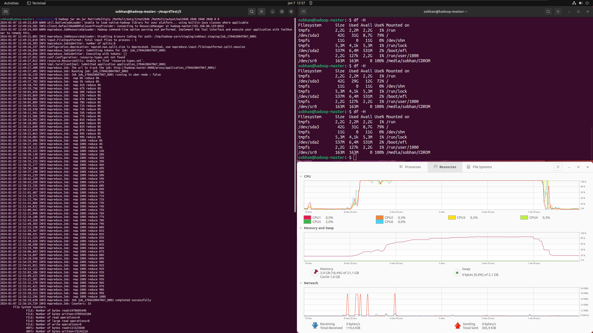

<h1 align="left">A look at Hadoop MapReduce in 2023</h1>
<a href="media/Presentation.ppsx">Presentation</a> for Cloud Computing Course (fall 2023)

## Two Examples Implemented in Hadoop MapReduce
Implemented both in Naive and Semi-optimized ways to showcase different levels of hadoop mapreduce bottlenecks.
- Sorted Histogram of WordCount
- Matrix Multiplication

## Hadoop Cluster Config Files and Setup Cheat Sheet Included
- hadoop
- Hadoop Setup.txt

## Example Run
